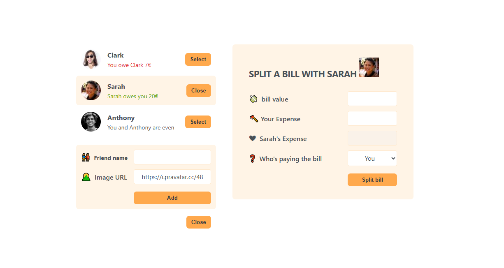

# 🍽 Eat 'n Split

A modern bill-splitting app built with _React_ that helps friends track shared expenses and balances in a fun, intuitive interface.

## 📸 Demo



## 🚀 Features

- 👫 Add and manage friends with custom avatars
- 💸 Track who owes whom and how much
- 📥 Add new bills and assign split responsibility
- 📊 Smart UI feedback showing who pays more
- ♻ Fully dynamic state using useState and conditional rendering

## 🛠 Built With

- ⚛ _React_ – Functional components & hooks
- 🎨 _CSS Modules_ – Simple, clean styling
- 🧠 _useState & Conditional Rendering_ – For interactivity
- 🗂 _Component-based architecture_ – Clean separation of concerns

## 🧠 What I Learned

This project deepened my understanding of:

- Thinking in _React_ by breaking UI into reusable components
- Handling _state management_ with useState
- Implementing _conditional UI updates_
- Managing _user inputs_ and interactions
- Building apps with real-world logic in mind
- I'm publishing this as a tool to learn Git and GitHup

## 📁 Folder Structure

eat-n-split/ ├── App.js ├── components/ │ ├── FriendList.js │ ├── AddFriendForm.js │ ├── SplitBillForm.js ├── data.js ├── index.js ├── styles/ │ ├── App.css

## 📦 Installation

```bash
git clone https://github.com/ahmedmostafa-io/eat-n-split.git
cd eat-n-split
npm install
npm run dev

✅ Future Improvements

⏳ Store data in LocalStorage

🧾 Add history of transactions

🌐 Deploy online via Vercel


📬 Contact

Made with 💙 by Ahmed Mostafa

Feel free to connect or suggest improvements!
```
